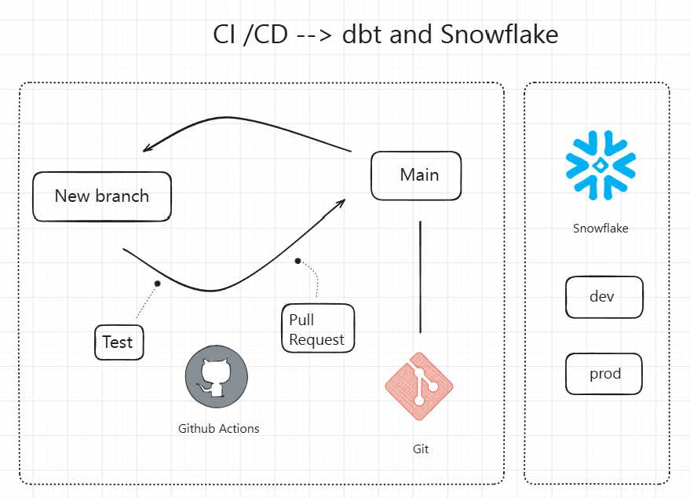
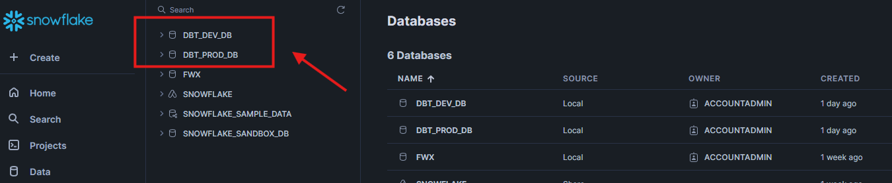

# CI / CD com Github Actions, dbt e Snowflake
O objetivo desse repositório é executar uma pipeline de CI /CD com Github Actions, dbt e Snowflake.

Vale ressaltar que esse repo foi criado usando como base o repo abaixo:

```
https://github.com/wlcamargo/ci-cd-dbt-snowflake
```

## Arquitetura


### Fluxo da pipeline
Ao criar uma branch e abrir uma Pull Request (PR), a pipeline de CI é acionada automaticamente para executar os testes. A PR só será aberta caso todos os testes sejam bem-sucedidos. Após a aprovação da PR, a pipeline de CD é responsável por implantar o projeto no ambiente de produção.


## Requisitos Prévios

* Assista o vídeo para conseguir entender o processo de processar dados no Snowflake com dbt.

Link: https://youtu.be/mBrk5hvqc84

* É necessário adicionar as variáveis de ambiente no Github

## Ambientes no Snowflake
No Snowflake, será necessário criar um ambiente de ```dev``` e ```prd```. Entra na pasta ```scripts``` e utilize os códigos do arquivo ```snowflake-setup.sql```. 

Resultado esperado:


## Conclusão
Se você chegou até aqui, parabéns! Já tens uma pipeline de CI/CD n Github Actions com dbt e Snowflake.

## Developer
| Desenvolvedor      | LinkedIn                                   | Email                        | Portfólio                              |
|--------------------|--------------------------------------------|------------------------------|----------------------------------------|
| Wallace Camargo    | [LinkedIn](https://www.linkedin.com/in/wallace-camargo-35b615171/) | wallacecpdg@gmail.com        | [Portfólio](https://wlcamargo.github.io/)   |
